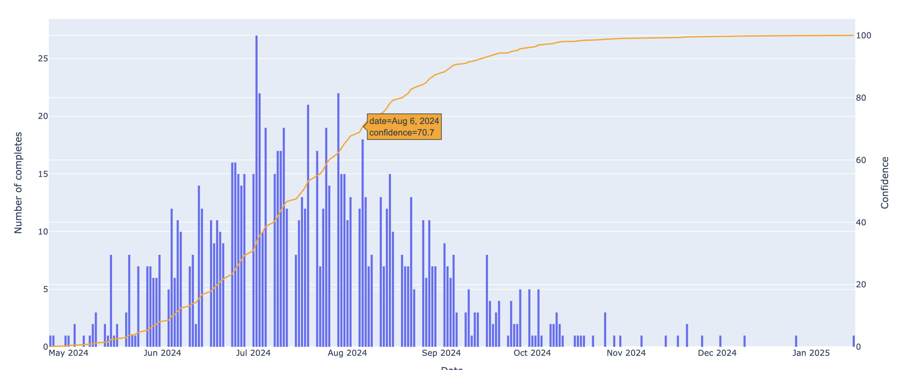

# JIRA Monte Carlo Forecaster

This forecaster focuses on estimating the date that a given backlog will be cleared. 

The script renders an interactive HTML file of the number of simulation completes on each date and the cumlative confidence against time. It will print the 70% confidence date. 

The script operates by randomly selecting a previous day and using the number of story points closed on that day to estimate the number of story points closed on a future date.

Below is an example of the output chart. The line is hovered over the 6th August showing a confidence of 70.7%. This means that there is a 70.7% chance that the backlog will be cleared by on the 6th August. 

# Dependencies

- JIRA, This was built against JIRA team project board so data structures for company projects may vary.
- Python: 3.10.6 (PyEnv)

# Set up

## Config
You can create your API key here https://id.atlassian.com/manage-profile/security/api-tokens

    JIRA_USERNAME=xxx
    JIRA_API_KEY=xxx
    JIRA_BASE_URL=https://xxx.atlassian.net

    JIRA_STORY_POINT_FIELD_ID=xxx

## Python

    virtualenv venv
    source venv/bin/activate

    python --version
    > 3.10.6

    pip install -r requirements.txt

    python jira_monte_carlo_forecast.py --jql-query 'parent = "A-123"'

# Notes and assumptions
- For accurate predictions all tickets need to be created.
- Assumes all tickets have story points assigned.
- Random numbers are used so predictions may vary slightly from run to run.
- Assumes no work done over the weekend. 

# TODO
- Exclusion dates e.g. XMAS
- Bank holidays are not excluded.
- Variable Done/ No Longer Relevant Field names
- Read more than 1000 issues
